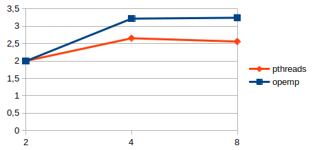

Luiz Felipe Lehmen Lersch 
elc139-Programação Paralela

1)
TRECHO 1
mysum += (a[i] * b[i]);

TRECHO 2
for (i = start; i < end ; i++)  {
         mysum += (a[i] * b[i]);
} 

TRECHO 3
pthread_mutex_lock (&mutexsum);
dotdata.c += mysum;
pthread_mutex_unlock (&mutexsum);

TRECHO 4
int wsize = dotdata.wsize;
int start = offset*wsize;
int end = start + wsize;

Particionamento: Já que o código faz um produto escalar, o tamanho dos vetores é o número de multiplicações que vão ocorrer, estas podem ser separadas e feitas paralelamente. TRECHO 1 representa a multiplicação entre 'a[i]' e 'b[i]' e que pode ocorrer paralelamente.
 

Comunicação: Todas threads tem acesso a variável dotdata(memória compartilhada) que guardará o resultado final,
 mas cada thread usa a sua variável mysum(memória distribuída) que fará as somas parciais. Vistos nos TRECHOS 2 e 3.

Aglomeração: Enquanto o TRECHO 2 representa a soma parcial das multiplicações, o TRECHO 3 é onde as somas parciais são somadas(está na thread e por isso é executado n threads vezes).

Mapeamento: cada processador fará a multiplicação 1280000 dividido pelo número de threads vezes, ou seja, distribuição estática. No TRECHO 4 vemos como é feita a distribuição, cada thread calculará wsize multiplicações, enquanto o offset que é o numero da thread dirá os indices da multiplicação.
EX: threads = 2, wsize = 640000
     
thread 1:  calculará dos índices 0*(640000 -1);
thread 2:  calculará dos índices 1*(640000 -1);

2)
Speedup(2 threads) = T(1 thread)/T(2 threads)  Speedup = 2,001820656

3)
Enquanto a aceleração melhora na sequencia 1->2->4 threads(98s->49s->37s), a partir da mudança de 4->8 o tempo estabiliza entre 37s e 38s devido ao número de threads suportado pelo computador.

4)

5)
Para responder chamarei phtread_dotprod.c de CÓDIGO1 e o phtread_dotprod2.c de CÓDIGO2.

A diferença entre os códigos 1 e 2 é o mutex implementado no TRECHO 3, o CÓDIGO1 tem o mutex enquanto o CÓDIGO2 não. Esse mutex faz com que somente 1 thread possa fazer a soma da variável dotdata.c com a mysum de cada vez. Já que não tem o mutex, o CÓDIGO2 pode apresentar erros se mais de uma thread acessar o valor da variável dotdata.c ao mesmo tempo, já que as threads usariam o mesmo valor para a soma.

EX: THREAD 1 acessa dotdata.c = 10 e somará com mysum = 2. Se alguma thread acessar a variável dotdata.c antes da soma acontecer e ser atualizado o valor, a segunda thread usará o mesmo valor 10 na soma. Usando mysum = 2 para a THREAD 2, dotdata.c será 12, quando deveria ser 14.

Referências: 
https://www.youtube.com/watch?v=nE-xN4Bf8XI&list=PLLX-Q6B8xqZ8n8bwjGdzBJ25X2utwnoEG
https://stackoverflow.com/questions/2396430/how-to-use-lock-in-openmp
